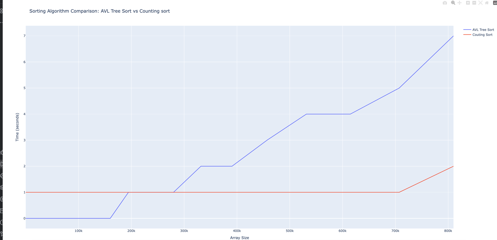

# Compare algorithms
Counting sort vs AVL tree sorting

Summary
1. Counting sort is not perfoming when the range is very big. For example, python can run out of memory for allocating a big chunk of memory
2. AVL performs better on a smaller array size and the number range is big

Case 1. Number Range is the same as the array size
Counting sort performs better

Case 2. Range between o and max python array size 
AVL performs better on a small array. Counting sort performs better overall

